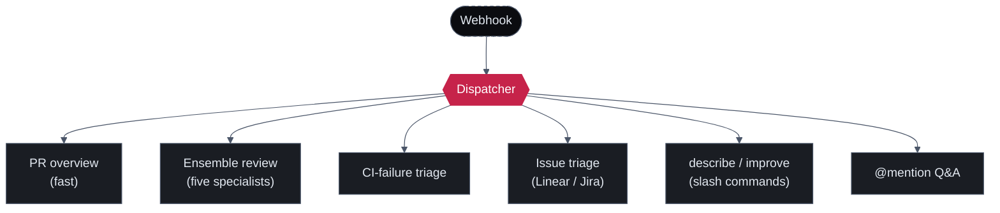

Sigilix subscribes to one stream of events from your forge: a GitHub or Linear webhook fires, and a single endpoint receives it. What happens next is not one fixed behavior. The dispatcher reads the event, decides what kind of work it represents, and routes it to the pipeline built for that work.

The motivation is simple: not every event deserves the full ensemble. Posting a fast description of what a PR changes is a different job than running four domain specialists plus a synthesizer over the diff. If both went through the same heavy path, the cheap passes would wait behind the expensive ones. The dispatcher keeps them separate.

## One event in, the right pipeline out

## The pipelines

<CardGroup cols={2}>
  <Card title="PR overview" icon="bolt">
    A fast pass that describes what the pull request changes. Cheap to run and useful immediately — it does not wait behind the full ensemble.
  </Card>
  <Card title="Ensemble review" icon="diagram-project" href="/how-it-works/the-ensemble">
    The full five-specialist pass: four domain specialists (Athena, Argus, Hermes, Themis) unified by Zeus, the synthesizer. This is the deep review.
  </Card>
  <Card title="CI-failure triage" icon="circle-exclamation">
    When a check fails, Sigilix reads the failure and posts a grounded, inline root-cause analysis instead of leaving you to scroll the raw log.
  </Card>
  <Card title="Issue triage" icon="list-check">
    Linear and Jira issues get rewritten titles, priority, estimate, labels, and assignee, plus a grounded root-cause comment and a link to the relevant PR.
  </Card>
  <Card title="describe / improve" icon="terminal">
    Slash commands route to targeted pipelines: <code>/sigilix describe</code> summarizes a change, <code>/sigilix improve</code> proposes refinements. See <a href="/configuration/commands">Commands</a>.
  </Card>
  <Card title="@mention Q&A" icon="comments">
    Mention <code>@sigilix</code> with a question and the dispatcher routes it to a grounded Q&A pipeline that answers against the repo and review history.
  </Card>
</CardGroup>

## Why route at all

<Note>
The point of the dispatcher is cost and latency isolation. The expensive work — the five-specialist ensemble running models tuned per role — is reserved for the events that need depth. Everything else takes a path sized to its job.
</Note>

A single endpoint that always ran the full ensemble would be slow and wasteful. A PR that only needs a one-paragraph overview would pay the price of a deep security, logic, performance, and test review. A CI failure would be analyzed by four domain specialists when it only needs a grounded read of the failure log. By classifying the event first, the dispatcher matches effort to need:

<Steps>
  <Step title="Receive">
    A webhook arrives from GitHub or Linear — a PR opened, a check failed, a comment posted, an issue created.
  </Step>
  <Step title="Classify">
    The dispatcher inspects the event and the comment body (for slash commands and mentions) to decide which pipeline it belongs to.
  </Step>
  <Step title="Route">
    The event is handed to its pipeline. Fast pipelines return quickly; the ensemble runs its full pass independently.
  </Step>
  <Step title="Respond">
    Each pipeline writes back to the place the developer already is — the PR thread, the check, or the issue.
  </Step>
</Steps>

## Read next

<CardGroup cols={2}>
  <Card title="Review Lifecycle" icon="timeline" href="/how-it-works/review-lifecycle">
    What happens inside the ensemble pipeline once the dispatcher hands it a PR.
  </Card>
  <Card title="The Believability Pipeline" icon="shield-check" href="/how-it-works/believability-pipeline">
    The five gates a finding must clear before it can post.
  </Card>
</CardGroup>
