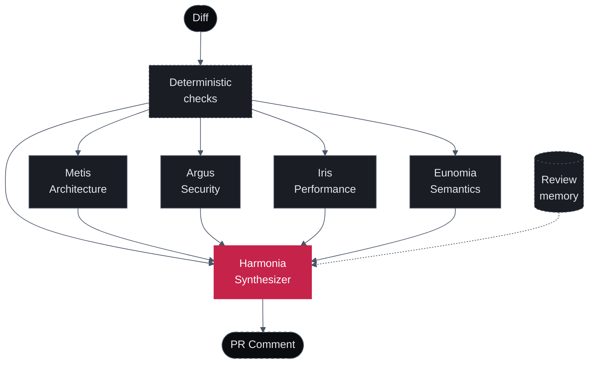

Most AI code review tools run a single model with a single prompt over the diff. The model is asked to be everything at once — security expert, performance engineer, architect, semantics nitpicker — and it does each role about half as well as a focused specialist would.

Sigilix's architecture is different. Five specialists run per review: four domain specialists in parallel — **Metis** (logic/architecture), **Argus** (security), **Iris** (performance), **Eunomia** (tests/semantics) — with focused prompts and role-tuned models, unified by **Harmonia**, the synthesizer that arbitrates between them. Before the LLM specialists fire, a pre-LLM layer of deterministic checks — secret scanning, AST rule packs, user-defined regex rules — extracts cheap signal from the diff.

## The topology

Every review goes:

1. **Deterministic checks run first** — secret scanning, AST rule packs, and any user-defined `deterministicChecks` regex rules run over the added diff lines. Their findings are injected into the specialist prompts as authoritative facts. See [Deterministic Checks](/how-it-works/deterministic-checks).
2. **Domain specialists run in parallel** — Metis, Argus, Iris, and Eunomia receive the same diff plus the deterministic findings as authoritative facts in their context. Each specialist has a different prompt and a model tuned to its role, and can't see the other specialists' findings. Each runs with a size-scaled budget and a cross-provider fallback that protects against same-family provider outages.
3. **Findings flow into Harmonia** — the synthesizer sees all four streams plus the deterministic findings plus the diff itself.
4. **Harmonia deduplicates, calibrates, and renders** — overlapping findings collapse into one; severity shifts based on agreement; review memory adjusts category-level flag-worthiness; each surviving finding earns a proof-tier receipt; the final verdict is decided.
5. **One comment is posted** — single GitHub review with the Harmonia summary at the top and inline findings below.

## Why this beats single-agent review

### 1. Different prompts catch different things

A single-agent reviewer with one prompt can ask the model to "look for security issues, performance issues, architectural violations, and naming problems." The model attends to roughly one of those at a time and trades off depth.

Sigilix's specialists each have a focused prompt. Argus is asked *only* about security. Its prompt is dense with OWASP-relevant patterns, secret-leak heuristics, and authentication boundary rules. The model running Argus's prompt finds more security issues than the same model running a generalist prompt — by a wide margin.

### 2. Different models suit different roles

Each specialist runs a model tuned to its role — a reasoning-heavy model for logic (Metis's architectural chain-of-thought), faster high-volume models for security and tests (Argus, Eunomia), a throughput-tuned model for performance (Iris), and a calibration-strong model for synthesis (Harmonia). The specific model behind each role is tuned over time from telemetry; the docs describe the role, not a model ID that churns.

All specialists have **cross-provider fallbacks** on independent infrastructure so a same-family outage can't silence multiple roles at once.

The right model for the job, not one model for everything. See [Specialists](/how-it-works/specialists) for per-role model selection.

### 3. Cross-reference suppresses hallucinations

Single-agent review hallucinates findings. The model is confidently wrong about a function being unused, a variable being uninitialized, or a security pattern being broken — when the reviewer reads the file in question, the finding is fiction.

Sigilix's synthesizer cross-references findings with the source code. If Argus flags a SQL injection at line 42 but Harmonia's structural-provenance check shows the parameter actually passes through a parameterized-query helper, the finding is suppressed before it reaches you.

The cross-reference is the difference between "AI review you tolerate" and "AI review you trust."

### 4. Severity calibration uses the agreement signal

When multiple specialists flag the same code, that's a strong signal. Harmonia escalates the severity in those cases:

- **One specialist flags + low confidence** → Info
- **One specialist flags + high confidence** → Warning
- **Two+ specialists flag** → Warning or Critical (depending on category)
- **Specialist + Harmonia's structural check confirms** → Critical

A single-agent reviewer can't calibrate this way — it has nobody to disagree with.

### 5. The interface is one comment, not 40

If you've used a single-agent reviewer that dumps every thought it has into the PR thread, you know the cost. Reviewers stop reading after the third "Consider adding a docstring." Real findings get buried.

Harmonia deduplicates relentlessly. If Argus and Iris both flag the same loop, you see one comment, not two. If a finding is a duplicate of one already posted on a prior SHA, you see it once.

## The trade-off

Multi-agent review is more expensive than single-agent review. Five model calls per PR cost more than one. Sigilix is in private beta; pricing is per-seat plus usage with bring-your-own-model support — see the marketing site for the current shape.

For most teams, the trade-off is worth it: a single missed security bug shipped to production costs vastly more than the per-PR review cost. For teams with very high PR volume, the per-PR cost can be tuned via [rate limits](/configuration/rate-limits) and [path filters](/configuration/path-filters-and-profile) that scope each review.

## Read next

<CardGroup cols={2}>
  <Card title="Specialists" icon="users" href="/how-it-works/specialists">
    Each of the four domain specialists in detail — what they catch, sample findings, model selection.
  </Card>
  <Card title="Synthesizer" icon="git-merge" href="/how-it-works/synthesizer">
    Harmonia's pipeline: collect → cross-reference → calibrate → render, inside the believability pipeline.
  </Card>
</CardGroup>
