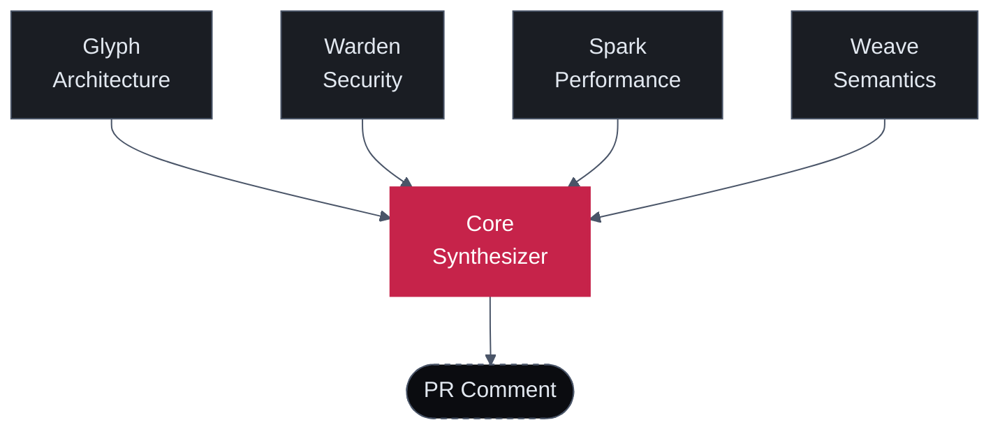

Most AI code review tools run a single model with a single prompt over the diff. The model is asked to be everything at once — security expert, performance engineer, architect, semantics nitpicker — and it does each role about half as well as a focused specialist would.

Sigilix's architecture is different. Five agents run in sequence: four parallel specialists, each tuned for one class of failure, and a synthesizer that arbitrates between them.

## The topology

Every review goes:

1. **Specialists run in parallel** — Glyph, Warden, Spark, and Weave receive the same diff but with different prompts and different model choices. They can't see each other's findings.
2. **Findings flow into Core** — the synthesizer sees all four streams plus the diff itself.
3. **Core deduplicates, calibrates, and renders** — overlapping findings collapse into one; severity shifts based on the agreement signal; the final verdict is decided.
4. **One comment is posted** — single GitHub review with the synthesizer summary at the top and inline findings below.

## Why this beats single-agent review

### 1. Different prompts catch different things

A single-agent reviewer with one prompt can ask the model to "look for security issues, performance issues, architectural violations, and naming problems." The model attends to roughly one of those at a time and trades off depth.

Sigilix's specialists each have a focused prompt. Warden is asked *only* about security. Its prompt is 600 words of OWASP-relevant patterns, secret-leak heuristics, and authentication boundary rules. The model running Warden's prompt finds more security issues than the same model running a generalist prompt — by a wide margin.

### 2. Different models suit different roles

Sigilix uses different model providers for different specialists. Logic-heavy tasks like Glyph's architectural reasoning use deepseek-v4-pro for its proof-style chain-of-thought. Security tasks where false-positive cost is high use kimi-k2.5 with retry+fallback to a different provider. Synthesis uses kimi-k2.6 for its calibration ability.

The right model for the job, not one model for everything. See [Specialists](/how-it-works/specialists) for per-role model selection.

### 3. Cross-reference suppresses hallucinations

Single-agent review hallucinates findings. The model is confidently wrong about a function being unused, a variable being uninitialized, or a security pattern being broken — when the reviewer reads the file in question, the finding is fiction.

Sigilix's synthesizer cross-references findings with the source code. If Warden flags a SQL injection at line 42 but Core's structural-provenance check shows the parameter actually passes through a parameterized-query helper, the finding is suppressed before it reaches you.

The cross-reference is the difference between "AI review you tolerate" and "AI review you trust."

### 4. Severity calibration uses the agreement signal

When multiple specialists flag the same code, that's a strong signal. Core escalates the severity in those cases:

- **One specialist flags + low confidence** → Info
- **One specialist flags + high confidence** → Warning
- **Two+ specialists flag** → Warning or Critical (depending on category)
- **Specialist + Core's structural check confirms** → Critical

A single-agent reviewer can't calibrate this way — it has nobody to disagree with.

### 5. The interface is one comment, not 40

If you've used a single-agent reviewer that dumps every thought it has into the PR thread, you know the cost. Reviewers stop reading after the third "Consider adding a docstring." Real findings get buried.

Core deduplicates relentlessly. If Warden and Spark both flag the same loop, you see one comment, not two. If a finding is a duplicate of one already posted on a prior SHA, you see it once.

## The trade-off

Multi-agent review is more expensive than single-agent review. Five model calls per PR cost more than one. Sigilix's pricing reflects that — see the [pricing tiers](https://sigilix.ai/signup) on the marketing site.

For most teams, the trade-off is worth it: a single missed security bug shipped to production costs vastly more than the per-PR review cost. For teams with very high PR volume, the per-PR cost can be tuned via [rate limits](/configuration/rate-limits) and [specialist disabling](/configuration/sigilix-yaml).

## Read next

<CardGroup cols={2}>
  <Card title="Specialists" icon="users" href="/how-it-works/specialists">
    Each of the four specialists in detail — what they catch, sample findings, model selection.
  </Card>
  <Card title="Synthesizer" icon="git-merge" href="/how-it-works/synthesizer">
    Core's pipeline: collect → cross-reference → calibrate → render.
  </Card>
</CardGroup>
