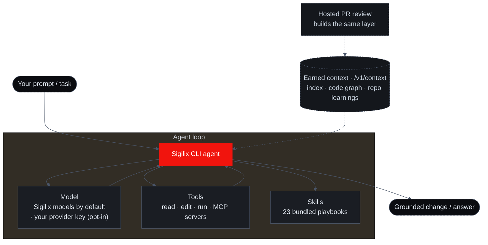

import { Callout, Cards, Steps } from 'nextra/components'
import { FeatureCards, FeatureCard } from '@/components/FeatureCards'

# Sigilix CLI

The hosted GitHub App reviews every PR. The Sigilix CLI brings that same review to where the change is born: your working tree. Run it against a dirty branch, a stash, or a diff range and you get the same five-specialist ensemble — **Logic** (logic & architecture), **Security** (security), **Performance** (performance), and **Tests** (tests), unified by **the synthesizer** — behind the same believability gates that decide what posts on a PR.

The point is not "AI in the terminal." The point is **parity without rebuild**. The CLI does not re-derive your repository from scratch each run. It reaches for the [earned-context layer](/how-it-works/earned-context) — the index, code graph, trust ledger, review memory, and evidence manifests that hosted reviews deposit — so a local review is judged against the whole repository, not the window of lines you happen to have changed.

<Callout type="info">
The Sigilix CLI is part of the **private beta**. Availability is per-account during the beta — [join the private beta](https://app.sigilix.ai) to get access, and contact <a href="mailto:support@sigilix.ai">support@sigilix.ai</a> if you are already in and want it enabled for your account.
</Callout>

## The grounded agent

`sigilix review` is one command. Running `sigilix` on its own launches a **grounded coding agent** — it reads, edits, and verifies code in your repo, calling tools and skills as it works. What makes it different from a generic terminal agent is the same thing that makes the review different: it reasons over the [earned-context layer](/how-it-works/earned-context) — the very layer the hosted reviews build — fetched over the `/v1/context` endpoint, so it starts from a repo that's already been indexed and graphed rather than re-discovering it each session.



The loop is standard — plan, call a tool, observe, repeat — but three things are Sigilix's: it **defaults to Sigilix's own models** (with opt-in [bring-your-own-key](/cli-and-chat/bring-your-own-models)), it can reach your connected [MCP servers](/mcp) and a library of [23 bundled skills](/cli-and-chat/overview#tools-and-skills), and every step is grounded in the earned-context layer the review engine already built.

## Why review locally

A PR review is a great backstop, but it fires after you have pushed, opened a PR, and asked teammates for their attention. By then the cost of a finding is higher — context-switching, force-pushes, re-review churn. The CLI moves the same depth one step earlier:

<FeatureCards>
<FeatureCard title="Same ensemble">
    Logic, Security, Performance, and Tests run in parallel and are unified by the synthesizer — identical roles to the hosted review, not a stripped-down lint pass.
</FeatureCard>
<FeatureCard title="Same gates">
    Findings clear the same believability pipeline before they surface, so the terminal is as quiet and as trustworthy as the PR thread.
</FeatureCard>
<FeatureCard title="Same context">
    The CLI fetches the earned-context layer instead of rebuilding it, so a local review reasons about callers and dependencies across the repo.
</FeatureCard>
<FeatureCard title="Before the PR">
    Catch the Critical finding while the fix is still a one-line edit in your editor — not a force-push after CI.
</FeatureCard>
</FeatureCards>

## How it works

The CLI is a thin client over the same engine the hosted App runs. It does three things: it figures out what changed, it fetches the verified understanding of your repo, and it runs the ensemble behind the gates.

<Steps>

### Resolve the diff

The CLI computes the change set the same way the hosted review does — a diff against a base (your merge-base with the default branch by default), or an explicit range you pass. Path filters and the profile from your `sigilix.json` are honored, so the CLI reviews exactly what a PR would.

### Run deterministic checks first

Before any model fires, the deterministic layer scans the diff for secrets, dependency vulnerabilities, AST rule violations, and any regex rules you've defined. Those findings are injected into the specialists as authoritative facts — exactly as on a PR. See [Deterministic Checks](/how-it-works/deterministic-checks).

### Fetch earned context

Instead of re-indexing your repo on every invocation, the CLI reaches for the earned-context layer the hosted reviews already built — the index, code graph, trust ledger, review memory, and evidence manifests. The diff is expanded with callers, dependencies, and symbols before any line is judged.

### Run the ensemble

Logic, Security, Performance, and Tests review the expanded diff in parallel. Each emits candidate findings anchored to specific lines.

### Pass the believability gates

Every candidate must clear the five-stage [believability pipeline](/how-it-works/believability-pipeline) — evidence, provenance, refute/execute, proof-tier receipts, memory — before it is allowed to surface.

### Synthesize and print

The synthesizer cross-checks the survivors, drops duplicates, calibrates severity, and prints one coherent review: a summary plus inline findings tagged by specialist and severity, each carrying its proof-tier pill.

</Steps>

## What a review looks like

A local review reads like the PR review you already know — one summary from the synthesizer, then findings anchored to files and lines, each tagged by specialist (Logic / Security / Performance / Tests), by severity (Critical / Warning / Info), and by proof tier (VERIFIED / GROUNDED / MODEL).

```bash
# Review the working tree against the default-branch merge-base
sigilix review

# Reviewing 7 changed files (against origin/main)…
#   deterministic checks ……… 1 dependency advisory injected
#   earned context …………………… index + code graph + review memory loaded
#   ensemble ……………………………… Logic · Security · Performance · Tests
#   synthesis ……………………………… the synthesizer
#
# ── src/auth/session.ts ─────────────────────────────────────
#   ✗ Critical · Security · GROUNDED   L42
#     Session token compared with == instead of a constant-time
#     compare; vulnerable to timing analysis.
#
#   ⚠ Warning · Logic · GROUNDED    L88
#     Early return skips the audit-log write on the error path.
#
# ── src/db/orders.ts ────────────────────────────────────────
#   ⚠ Warning · Performance · MODEL        L17
#     Query inside the loop — likely N+1 over `order.items`.
#
# Verdict: Request changes · 1 Critical · 2 Warnings
```

<Callout type="info">
The output above is illustrative — exact wording, glyphs, and counts depend on your repo and the change. The shape is real: a synthesizer summary, inline findings tagged by specialist and severity, and a proof-tier pill on every finding.
</Callout>

## Common workflows

<details>
<summary>Review before you open the PR</summary>

The default loop: make your change, run `sigilix review`, fix what surfaces, then push. Because the CLI uses the same diff resolution and the same gates as the hosted App, what you clear locally is what the PR review would have found — minus the round-trip.

</details>
  <details>
<summary>Review a specific range</summary>

Point the CLI at an explicit diff range to review a series of commits, a feature branch against its base, or a single commit in isolation. This is useful when you want to review work that is already committed but not yet pushed.

```bash
sigilix review --base origin/main
sigilix review --range HEAD~3..HEAD
```

</details>
  <details>
<summary>Scope a review with path filters</summary>

The CLI honors the path filters and profile from your `sigilix.json`, so monorepo packages, generated files, and vendored directories are excluded exactly as they are on a PR. You can also narrow a single run to a subtree when you only want feedback on one area.

```bash
sigilix review --path "packages/api/**"
```

</details>
  <details>
<summary>Use it in a pre-push hook or CI</summary>

Because the CLI exits with a non-zero status when a blocking finding survives the gates, you can wire it into a Git pre-push hook or a CI step as a fast first pass — letting the hosted PR review be the authoritative backstop rather than the first time anyone sees the problem.

</details>

## Bring your own key

The CLI runs on Sigilix's own models by default. On paid tiers you can optionally connect **your own model-provider API key** — OpenAI, Anthropic, or OpenRouter — so the CLI agent runs on your provider and bills you directly. Your model still fetches Sigilix's verified context layer, so it inherits the grounding without re-deriving the repo.

```bash
# Inspect the model behind your terminal workflow (defaults to Sigilix's models)
sigilix config model
```

See [Bring Your Own Key](/cli-and-chat/bring-your-own-models) for the full picture. This is **CLI-only and opt-in**: the [Deep-Research Chat](/cli-and-chat/deep-research) always runs on Sigilix models, and the hosted PR ensemble runs Sigilix's per-role tuned models with cross-provider fallback.

## How the CLI relates to the hosted App

The CLI and the GitHub App are two surfaces over one engine. The App is the authoritative, always-on backstop on every PR; the CLI is the same review pulled forward into your terminal. Crucially, the relationship is symbiotic: hosted reviews **build** the earned-context layer, and the CLI **reads** from it. The more your repo is reviewed, the cheaper and more grounded every local review becomes.

<Cards>
<Cards.Card title="Deep-Research Chat" href="/cli-and-chat/deep-research">
    Ask why a finding fired or what a change affects — answers grounded in the same earned-context layer.
  </Cards.Card>
<Cards.Card title="Command reference" href="/cli-and-chat/commands">
    The CLI commands — review, chat, config, and auth — with representative usage.
  </Cards.Card>
<Cards.Card title="The Ensemble" href="/how-it-works/the-ensemble">
    The five-specialist architecture the CLI brings to the terminal.
  </Cards.Card>
<Cards.Card title="Earned Context" href="/how-it-works/earned-context">
    The reusable, verified layer every review deposits — and what the CLI reads from.
  </Cards.Card>
</Cards>
