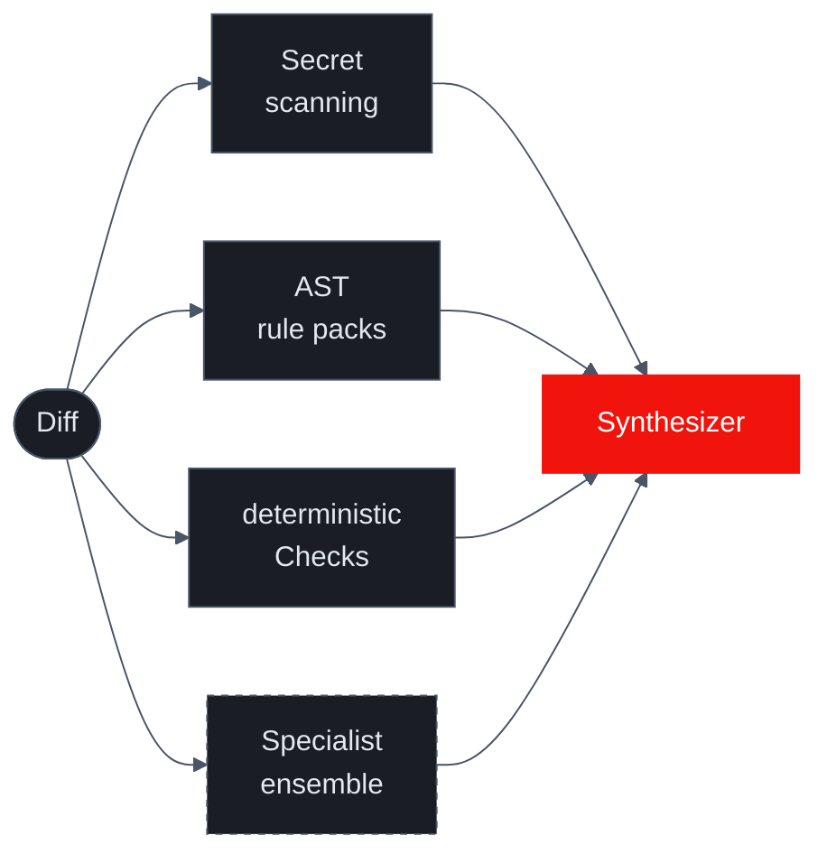

import { Cards } from 'nextra/components'

# Deterministic Checks

LLM specialists are good at reasoning over code but expensive and probabilistic. Some categories of finding — banned APIs, stray secrets, dead-simple regressions — don't need reasoning. They need a regex or an AST visitor.

Sigilix has a **deterministic checks layer** that runs *before* the four domain specialists. Matches surface as authoritative findings that the synthesizer treats as ground truth, not as another opinion to weigh.

## Three subsystems, one philosophy

The layer is three independent subsystems:

| Subsystem | What it catches | Shipped in |
|---|---|---|
| Secret scanning | Hardcoded provider credentials (AWS, GCP, Stripe, GitHub PATs, etc.) | ARC-187 |
| AST rule packs | JS/TS patterns (currently `no-eval-call` and a small starter list) | ARC-181 |
| `deterministicChecks` | User-defined regex rules from `sigilix.json` | ARC-193 |

All three run on the **added diff lines** (the `+` side of the unified diff). All three produce structured findings the synthesizer must contend with. None of them call a model.

## Why deterministic signal matters

### 1. Some patterns are flat, not contextual

`AKIA[0-9A-Z]{16}` is an AWS access key whether it appears in `src/`, `tests/`, a comment, or a markdown file. There's no nuance to weigh. A regex catches it in microseconds with zero false positives on the pattern itself.

The same is true of `eval(`, `console.log` left in committed code, `TODO` without a date marker, banned import paths. The LLM specialists would catch these *most* of the time — but most isn't always. A regex catches them every time.

### 2. Deterministic findings have perfect provenance

The synthesizer's job is to suppress LLM hallucinations. A finding like "function `foo` is unused at line 42" is something it has to verify against the source.

A finding like "regex `AKIA[0-9A-Z]{16}` matched line 142 of `config.ts`" has nothing to verify. The match happened. The line is real. The synthesizer can treat it as authoritative without re-checking.

### 3. They run before the LLM, not alongside

Because the layer runs first, its findings are **injected into the specialist prompts as facts**. When the security specialist gets the prompt, it already knows "the secret scanner flagged an AKIA key on line 142." It doesn't have to rediscover the secret; it can focus on the surrounding code path (how does the key get used? is it logged anywhere?).

This converts the LLM's job from "find things" into "reason about things that were found." That's a much shorter prompt and a higher-yield one.

## Secret scanning (ARC-187)

A built-in scanner that runs before the LLM specialists. Catches the most common provider patterns:

- AWS access keys (`AKIA...`, `ASIA...`)
- GCP service-account keys
- Stripe secret keys (`sk_live_...`, `sk_test_...`)
- GitHub personal access tokens (`ghp_...`, `gho_...`, `ghu_...`)
- Slack bot/user tokens (`xoxb-...`, `xoxp-...`)
- Generic high-entropy strings flagged by heuristic prefix rules

Findings are always `critical`-severity and surface in the Sigilix review with a rotation-required call to action.

For repo-specific patterns (your own internal key prefixes, partner credentials), use [`deterministicChecks`](/configuration/deterministic-checks-config).

## AST rule packs (ARC-181)

For JS/TS code, Sigilix parses each added file into an AST and runs a small starter rule pack:

| Rule | What it catches |
|---|---|
| `no-eval-call` | Calls to `eval()` — banned in production code |

The infrastructure supports adding more rules (mirroring ESLint's rule shape). The starter pack is intentionally tiny — most projects already run ESLint, and Sigilix doesn't want to duplicate that. The rules that stay in `astRules` are ones with strong agreement across codebases (e.g., `eval` is never legitimate in production paths).

To disable: `{ "astRules": { "enabled": false } }`.

## `deterministicChecks` (ARC-193)

The user-defined regex layer. See [Writing Deterministic Checks](/configuration/deterministic-checks-config) for the full practical reference.

The conceptual point: `deterministicChecks` lives in `sigilix.json` and is read on every review. Each rule is a regex plus a severity plus a message. Matches against added diff lines surface as findings.

This is the layer for **repo-specific patterns**. Examples:

- Internal API key prefixes the built-in scanner doesn't know about
- Banned imports during a deprecation window
- Style rules that aren't worth a linter but are worth flagging

The synthesizer treats `deterministicChecks` findings the same as built-in scanner findings — authoritative.

## How the synthesizer uses these findings

When the synthesizer runs:

1. Deterministic findings are emitted directly into the review at their declared severity. They're not subject to the "cross-reference adjustment" step that LLM findings go through, because there's nothing to cross-reference.
2. LLM findings that overlap a deterministic finding's `path:line` are merged — the deterministic finding becomes the spine of the merged comment, with LLM reasoning added as context.
3. The verdict is escalated to "Request changes" whenever a `critical` deterministic finding appears, regardless of LLM specialist outcomes.

The net effect: deterministic findings get **priority** in the final review. They're cheap, they're certain, and they're the most actionable category of finding for the reader.

## Costs

| Subsystem | Cost per review |
|---|---|
| Secret scanning | ~milliseconds; no model call |
| AST rule packs | ~milliseconds on small diffs; bounded by parse time on huge diffs |
| `deterministicChecks` | Linear in `(rules × added lines)` |

None of these contribute to model spend or to the rate-limit budget. They're effectively free.

## Read next

<Cards>
<Cards.Card title="Writing Deterministic Checks" href="/configuration/deterministic-checks-config">
    The practical syntax reference.
  </Cards.Card>
<Cards.Card title="Secret Scanning" href="/evidence-and-provenance/secret-scanning">
    Patterns the built-in scanner catches.
  </Cards.Card>
</Cards>
