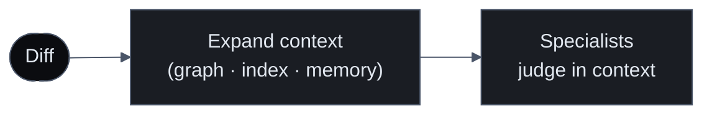

import { Callout, Cards } from 'nextra/components'
import { FeatureCards, FeatureCard } from '@/components/FeatureCards'

# Earned Context

A reviewer that starts from zero every time is doing the same expensive work over and over. Sigilix doesn't. Each review leaves something behind — a verified layer of understanding about your repository — and the next review, the CLI, and the chat all build on it instead of rediscovering it.

This is what makes Sigilix judge a diff in context. Before any specialist runs, Sigilix expands the change against the whole repo: who calls the function being modified, what depends on it, which symbols it touches. The diff is read against the repository, not through a keyhole.

## Context before judgment

A finding like "this function no longer handles the null case" is only correct if you know every caller. A window of a few diff lines cannot tell you that. Sigilix pulls in callers, dependencies, and symbols from the code graph and index, and reconciles against review memory, so a specialist is reasoning about the real blast radius of a change — not just the lines that changed.

## The layers a review deposits

<FeatureCards>
<FeatureCard title="Index">
    A searchable map of the repository — files, symbols, and structure — so context can be retrieved without re-reading the whole tree each time.
</FeatureCard>
<FeatureCard title="Code graph">
    Callers, dependencies, and symbol relationships. This is how Sigilix finds the blast radius of a change and judges the diff against the whole repo.
</FeatureCard>
<FeatureCard title="Trust ledger">
    The record behind proof-tier receipts — what was verified, what was grounded, and how findings earned their tier over time.
</FeatureCard>
<FeatureCard title="Review memory">
    What Sigilix has learned about this repo: taught rules (see <a href="/how-it-works/conversational-learnings">Conversational Learnings</a>) and the statistical accept/dismiss signal.
</FeatureCard>
<FeatureCard title="Evidence manifests">
    The cited code, anchors, and checks that back each finding — the provenance that lets a claim be re-examined rather than re-derived.
</FeatureCard>
</FeatureCards>

<Callout type="info">
Each layer is <em>verified</em> understanding, not a cache of raw text. It is built by the same gates that decide what posts, so the context a later review inherits is context that already earned its place.
</Callout>

## Who draws on it

The earned-context layer is not just for the next PR review. It is the substrate the rest of the product reads from:

<Cards>
<Cards.Card title="The CLI" href="/cli-and-chat/overview">
    Review parity in the terminal, drawing on the same index, graph, and memory the hosted reviews built.
  </Cards.Card>
<Cards.Card title="Deep-Research Chat" href="/cli-and-chat/overview">
    Grounded answers about the repo and its review history, because the history is a retrievable layer.
  </Cards.Card>
<Cards.Card title="Triage" href="/how-it-works/the-dispatcher">
    CI-failure and issue triage reason against the graph and memory to produce grounded root causes.
  </Cards.Card>
</Cards>

## Why it compounds

The first review on a repo pays to build the index and graph. Every review after that adds to the trust ledger, sharpens review memory, and accumulates evidence manifests. The understanding deepens with use — which is why a reviewer that remembers your repo gets more useful the longer it works on it, and why the same understanding can power the CLI and chat without rebuilding it from scratch.

## Read next

<Cards>
<Cards.Card title="The Believability Pipeline" href="/how-it-works/believability-pipeline">
    The gates that build the trust ledger and evidence manifests as findings earn their place.
  </Cards.Card>
<Cards.Card title="CLI & Chat" href="/cli-and-chat/overview">
    How the terminal and Deep-Research Chat read from the earned-context layer.
  </Cards.Card>
</Cards>
