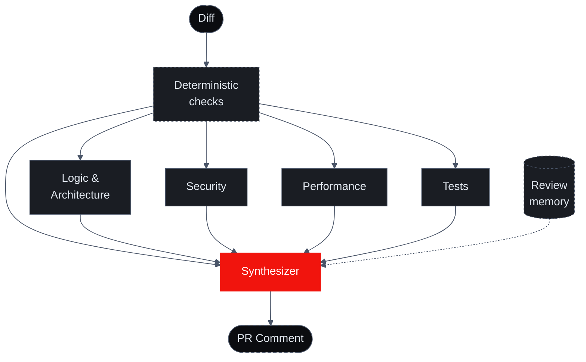

import { Cards } from '@/components/Cards'

# The Ensemble

The most direct way to build AI code review is to run a single model with a single prompt over the diff. That one model is asked to be everything at once — security expert, performance engineer, architect, semantics nitpicker — and a lone generalist does each role about half as well as a focused specialist would.

Sigilix's architecture is different. Four domain specialists run per review, in parallel — **Logic & Architecture**, **Security**, **Performance**, **Tests** — with focused prompts and role-tuned models, unified by the **synthesizer** that arbitrates between them. Before the LLM specialists fire, a pre-LLM layer of deterministic checks — secret scanning, AST rule packs, user-defined regex rules — extracts cheap signal from the diff.

## The topology

Every review goes:

1. **Deterministic checks run first** — secret scanning, AST rule packs, and any user-defined `deterministicChecks` regex rules run over the added diff lines. Their findings are injected into the specialist prompts as authoritative facts. See [Deterministic Checks](/how-it-works/deterministic-checks).
2. **Domain specialists run in parallel** — logic, security, performance, and tests receive the same diff plus the deterministic findings as authoritative facts in their context. Each specialist has a different prompt and a model tuned to its role, and can't see the other specialists' findings. Each runs with a size-scaled budget and a cross-provider fallback that protects against same-family provider outages.
3. **Findings flow into the synthesizer** — the synthesizer sees all four streams plus the deterministic findings plus the diff itself.
4. **The synthesizer deduplicates, calibrates, and renders** — overlapping findings collapse into one; severity shifts based on agreement; review memory adjusts category-level flag-worthiness; each surviving finding earns a proof-tier receipt; the final verdict is decided.
5. **One comment is posted** — single GitHub review with the synthesizer summary at the top and inline findings below.

## Why Sigilix runs a specialist ensemble

Splitting a review across focused specialists and a synthesizer is a deliberate design choice. Here is what each part earns its keep for, and why the whole is worth more than the same model calls run as one generalist pass.

### 1. Different prompts catch different things

A single-agent design with one prompt asks the model to "look for security issues, performance issues, architectural violations, and naming problems." The model attends to roughly one of those at a time and trades off depth.

Sigilix's specialists each have a focused prompt. The security specialist is asked *only* about security. Its prompt is dense with OWASP-relevant patterns, secret-leak heuristics, and authentication boundary rules. The model running that prompt finds more security issues than the same model running a generalist prompt — by a wide margin.

### 2. Different models suit different roles

Each specialist runs a model tuned to its role — a reasoning-heavy model for logic, faster high-volume models for security and tests, a throughput-tuned model for performance, and a calibration-strong model for synthesis. The specific model behind each role is tuned over time from telemetry; the docs describe the role, not a model ID that churns.

All specialists have **cross-provider fallbacks** on independent infrastructure so a same-family outage can't silence multiple roles at once.

The right model for the job, not one model for everything. See [Specialists](/how-it-works/specialists) for per-role model selection.

### 3. Cross-reference suppresses hallucinations

A single-agent design is prone to hallucinated findings. One model, with nothing to check it, can be confidently wrong about a function being unused, a variable being uninitialized, or a security pattern being broken — and when the file in question is actually read, the finding is fiction.

Sigilix's synthesizer cross-references findings with the source code. If the security specialist flags a SQL injection at line 42 but the synthesizer's structural-provenance check shows the parameter actually passes through a parameterized-query helper, the finding is suppressed before it reaches you.

The cross-reference is the difference between "AI review you tolerate" and "AI review you trust."

### 4. Severity calibration uses the agreement signal

When multiple specialists flag the same code, that's a strong signal. The synthesizer escalates the severity in those cases:

- **One specialist flags + low confidence** → Info
- **One specialist flags + high confidence** → Warning
- **Two+ specialists flag** → Warning or Critical (depending on category)
- **Specialist + the synthesizer's structural check confirms** → Critical

A single-agent design can't calibrate this way — it has nobody to disagree with.

### 5. The interface is one comment, not 40

A single-agent design that dumps every thought it has into the PR thread carries a cost you may have felt: reviewers stop reading after the third "Consider adding a docstring," and real findings get buried.

The synthesizer deduplicates relentlessly. If two specialists both flag the same loop, you see one comment, not two. If a finding is a duplicate of one already posted on a prior SHA, you see it once.

## The cost, and the curve

An ensemble makes more model calls than a single pass — that is the honest cost. What bends the curve back is memory. Every review deposits durable context into your organization's [memory index](/memory/overview), so each subsequent review starts more org-aware: it leans on cheaper deterministic and remembered signal, suppresses findings your team has already dismissed, and spends fewer tokens re-deriving what Sigilix already knows about your codebase. The same index feeds review, [triage](/triage/overview), the CLI, and the [Slack assistant](/slack-assistant/overview) — one org-aware platform that compounds with use, rather than a stack of point tools that each start cold.

Sigilix pricing is per-seat plus usage across the Free, Pro, Teams, Max, and Ultra plans, with bring-your-own-key support on the CLI and chat surfaces — see [pricing](https://sigilix.ai/pricing) for the current shape.

For most teams, the economics are clear: a single missed security bug shipped to production costs vastly more than the per-PR review cost. For teams with very high PR volume, the per-PR cost can be tuned via [rate limits](/configuration/rate-limits) and [path filters](/configuration/path-filters-and-profile) that scope each review.

## Read next

<Cards>
<Cards.Card title="Specialists" href="/how-it-works/specialists">
    Each of the four domain specialists in detail — what they catch, sample findings, model selection.
  </Cards.Card>
<Cards.Card title="Synthesizer" href="/how-it-works/synthesizer">
    the synthesizer's pipeline: collect → cross-reference → calibrate → render, inside the believability pipeline.
  </Cards.Card>
</Cards>
