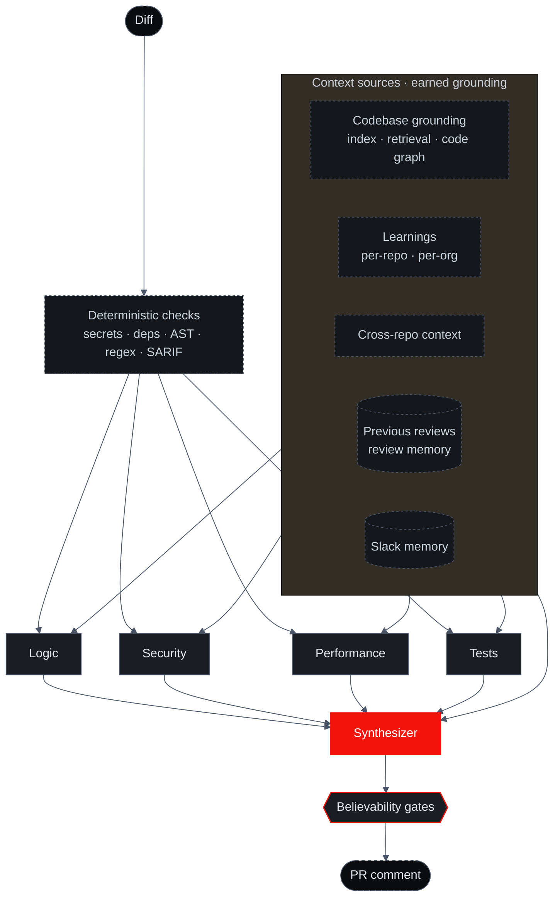

import { Callout, Cards } from 'nextra/components'
import { FeatureCards, FeatureCard } from '@/components/FeatureCards'

# The Ensemble

Most AI code review tools run a single model with a single prompt over the diff. The model is asked to be everything at once — security expert, performance engineer, architect, semantics nitpicker — and it does each role about half as well as a focused specialist would.

Sigilix's architecture is different. Five specialists run per review: four domain specialists in parallel — **Logic, Security, Performance, and Tests** — with focused prompts and role-tuned models, unified by a fifth role, the **Synthesizer**, that arbitrates between them. But the specialists never judge the raw diff alone. A deterministic layer runs first (secret scanning, dependency-vulnerability checks, AST rule packs, user-defined regex, ingested SARIF), and a grounding layer surrounds the change with verified context before any model reasons about a line.

## The topology

The picture people usually draw for AI review is "diff → model → comment." Sigilix's is wider: the diff goes through deterministic checks, the four specialists judge it against many verified context sources in parallel, and the Synthesizer reconciles their findings before anything clears the believability gates and posts.

Every review goes:

1. **The deterministic layer runs first** — secret scanning, dependency-vulnerability checks, AST rule packs, ingested SARIF, and any user-defined `deterministicChecks` regex run over the added diff lines. Their findings are injected into the specialist prompts as authoritative facts, scoped so each role sees only what's relevant to it. See [Deterministic Checks](/how-it-works/deterministic-checks).
2. **The grounding layer expands the change** — before any line is judged, Sigilix pulls the [earned context](/how-it-works/earned-context): the codebase grounding (index, retrieval, and the code graph — callers, dependents, blast radius), the learned rules for this repo and its org, cross-repo context, previous reviews and their dismissals (review memory), and Slack memory. The diff is read against the whole repository, not a window.
3. **Domain specialists run in parallel** — **Logic, Security, Performance, and Tests** each receive the same diff plus the deterministic findings as authoritative facts. Each has its own prompt and a model tuned to its role, can't see the other specialists' findings, runs on a size-scaled budget, and has a cross-provider fallback that protects against same-family provider outages.
4. **Findings flow into the Synthesizer** — which sees all four specialist streams, the diff, and the same context sources, so it can soften or suppress noise the specialists surfaced (for example, a finding this repo has dismissed before).
5. **The Synthesizer deduplicates, calibrates, and gates** — overlapping findings collapse into one; severity shifts based on agreement; review memory adjusts category-level flag-worthiness; each survivor is cross-checked and stamped with a proof-tier receipt as it clears the [believability gates](/how-it-works/believability-pipeline).
6. **One comment is posted** — a single GitHub review with the Synthesizer summary at the top and inline findings below, each anchored to the line it quotes.

## What feeds a review

The strength of the review is not just the models — it's what those models reason over. Each of these is a distinct, verified source, not a paraphrase of the diff:

<FeatureCards>
<FeatureCard title="Codebase grounding">
    Semantic + lexical retrieval from the repo index, plus the code graph — callers, dependents, and the blast radius of a change — so a specialist reasons about the real reach of an edit, not the lines that changed.
</FeatureCard>
<FeatureCard title="Deterministic facts">
    Secret hits, dependency advisories, AST rule violations, and ingested SARIF are injected as authoritative facts — cheap, certain signal the models treat as ground truth. See [Deterministic Checks](/how-it-works/deterministic-checks).
</FeatureCard>
<FeatureCard title="Learnings (repo + org)">
    The rules your team has taught — per repo, and unioned across the org for cross-repo grounding — shape what the specialists and the Synthesizer flag. See [Conversational Learnings](/how-it-works/conversational-learnings).
</FeatureCard>
<FeatureCard title="Previous reviews">
    Review memory — how similar findings were accepted or dismissed on past PRs — lets the Synthesizer soften noise the repo has already rejected. See [Review Memory](/how-it-works/review-memory).
</FeatureCard>
</FeatureCards>

<Callout type="info">
This same earned-context layer — codebase grounding, learnings, and review memory — is what the [CLI agent](/cli-and-chat/cli), [Deep-Research Chat](/cli-and-chat/deep-research), and [Slack assistant](/slack-assistant/overview) read from. One substrate, many surfaces: every hosted review makes it richer, and every other surface inherits that richness.
</Callout>

## Why this beats single-agent review

### 1. Different prompts catch different things

A single-agent reviewer with one prompt can ask the model to "look for security issues, performance issues, architectural violations, and naming problems." The model attends to roughly one of those at a time and trades off depth.

Sigilix's specialists each have a focused prompt. Security is asked *only* about security. Its prompt is dense with OWASP-relevant patterns, secret-leak heuristics, and authentication boundary rules. The model running Security's prompt finds more security issues than the same model running a generalist prompt — by a wide margin.

### 2. Different models suit different roles

Each specialist runs a model tuned to its role — a reasoning-heavy model for logic (Logic's architectural chain-of-thought), faster high-volume models for security and tests (Security, Tests), a throughput-tuned model for performance (Performance), and a calibration-strong model for synthesis (the synthesizer). The specific model behind each role is tuned over time from telemetry; the docs describe the role, not a model ID that churns.

All specialists have **cross-provider fallbacks** on independent infrastructure so a same-family outage can't silence multiple roles at once.

The right model for the job, not one model for everything. See [Specialists](/how-it-works/specialists) for per-role model selection.

### 3. Cross-reference suppresses hallucinations

Single-agent review hallucinates findings. The model is confidently wrong about a function being unused, a variable being uninitialized, or a security pattern being broken — when the reviewer reads the file in question, the finding is fiction.

Sigilix's synthesizer cross-references findings with the source code. If Security flags a SQL injection at line 42 but the synthesizer's structural-provenance check shows the parameter actually passes through a parameterized-query helper, the finding is suppressed before it reaches you.

The cross-reference is the difference between "AI review you tolerate" and "AI review you trust."

### 4. Severity calibration uses the agreement signal

When multiple specialists flag the same code, that's a strong signal. The synthesizer escalates the severity in those cases:

- **One specialist flags + low confidence** → Info
- **One specialist flags + high confidence** → Warning
- **Two+ specialists flag** → Warning or Critical (depending on category)
- **Specialist + the synthesizer's structural check confirms** → Critical

A single-agent reviewer can't calibrate this way — it has nobody to disagree with.

### 5. The interface is one comment, not 40

If you've used a single-agent reviewer that dumps every thought it has into the PR thread, you know the cost. Reviewers stop reading after the third "Consider adding a docstring." Real findings get buried.

The synthesizer deduplicates relentlessly. If Security and Performance both flag the same loop, you see one comment, not two. If a finding is a duplicate of one already posted on a prior SHA, you see it once.

## The trade-off

Multi-agent review is more expensive than single-agent review. Five model calls per PR cost more than one. Sigilix is in private beta; pricing is per-seat plus usage, with optional bring-your-own-key on the CLI — see the marketing site for the current shape.

For most teams, the trade-off is worth it: a single missed security bug shipped to production costs vastly more than the per-PR review cost. For teams with very high PR volume, the per-PR cost can be tuned via [rate limits](/usage-and-limits/pr-review-rate-limits) and [path filters](/configuration/path-filters-and-profile) that scope each review.

## Read next

<Cards>
<Cards.Card title="Specialists" href="/how-it-works/specialists">
    Each of the four domain specialists in detail — what they catch, sample findings, model selection.
  </Cards.Card>
<Cards.Card title="Synthesizer" href="/how-it-works/synthesizer">
    The synthesizer's pipeline: collect → cross-reference → calibrate → render, inside the believability pipeline.
  </Cards.Card>
</Cards>
