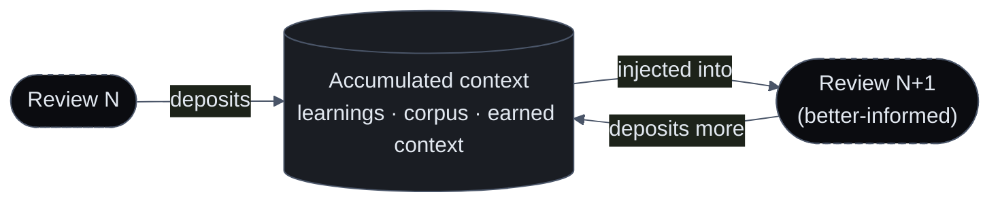

import { Callout, Steps } from 'nextra/components'
import { Cards } from '@/components/Cards'
import { FeatureCards, FeatureCard } from '@/components/FeatureCards'

# The Compounding Advantage

Sigilix tunes its own model line for engineering work — that is the product. What makes those models *yours* is **your organization's accumulated context**: the rules your team taught, the categories it consistently values or dismisses, and the verified understanding of your repositories that every review deposits. That corpus is the fuel our models run on. It is yours, it grows every time Sigilix reviews your code, and it makes each subsequent review more tailored than the last — because the same tuned models are now reasoning over context no competitor can reconstruct.

<Callout type="info">
This is the flywheel: **the tools fuel the models.** As your org accumulates memory and earned context, Sigilix's tuned models are handed richer, more specific information about your codebase and conventions on every review — so the same models that are strong on engineering in general get sharper on *your* system in particular.
</Callout>

## What accumulates

Four distinct stores grow per organization, and each sharpens a different part of a review:

<FeatureCards>
<FeatureCard title="Conversational Learnings">
    Every rule your team teaches — captured, scoped, and mirrored installation-wide — is injected into future review prompts as explicit repository-specific guidance. See <a href="/memory/conversational-learnings">Conversational Learnings</a>.
</FeatureCard>
<FeatureCard title="The accept / dismiss corpus">
    The categories your team consistently acts on or dismisses calibrate flag-worthiness per repo, so the review's noise floor fits your team's taste. See <a href="/memory/review-memory">Review Memory</a>.
</FeatureCard>
<FeatureCard title="Earned context">
    The semantically-embedded code index and the code graph, rebuilt as your repo evolves, let each review reason about callers, dependencies, and blast radius across the whole repository. See <a href="/how-it-works/earned-context">Earned Context</a>.
</FeatureCard>
<FeatureCard title="Seat memory">
    Per-developer memory the CLI agent accumulates, recalled semantically, so terminal sessions get more fluent with your codebase over time. See <a href="/memory/org-and-seat-layering">Org &amp; Seat Layering</a>.
</FeatureCard>
</FeatureCards>

## How it compounds

Each of these is deposited by the work you're already doing, and read back into the next piece of work — a flywheel, not a batch job.

<Steps>

### The first review pays the setup cost

The first time Sigilix reviews a repo, it builds the index and code graph and starts with an empty memory. This is the most expensive review the repo will ever get, and the least tailored.

### Every review deposits more

Each subsequent review adds to the trust ledger, sharpens the accept/dismiss corpus, and — whenever your team corrects or teaches it — captures new learnings. Nothing is thrown away except what deliberately ages out.

### The next review inherits it all

Before the specialists judge the next diff, Sigilix fuels its tuned models with the relevant learnings, the calibrated corpus signals, and the earned context. The review is now judged against your repository and your team's stated conventions — not a generic notion of "good code."

### The gap widens

The more your org uses Sigilix, the more context each review inherits, and the more tailored — and quieter on your team's known non-issues — it becomes. A competitor starting fresh on your codebase has none of this; they'd have to re-earn it, one correction at a time.

</Steps>

## Why competitors can't clone it

A rival can stand up a review tool tomorrow. What they cannot obtain is the record of every judgment your team has made inside Sigilix — because that record is *created by your team's use of the product*. It is not a dataset Sigilix ships; it is your organization's own accumulated context, scoped to you and never shared across customers. The switching cost this creates is real and grows with every review: leaving means starting the flywheel over from zero somewhere else.

<Callout type="info">
The corollary: the value shows up with use. A repo's first week of reviews is the least tailored it will ever be; give the memory a few correction cycles and the reviews visibly fit your codebase better. That's the intended shape — a reviewer that earns its understanding of *your* code.
</Callout>

## Read next

<Cards>
<Cards.Card title="Memory overview" href="/memory/overview">
    The layers of memory and how they fit together.
  </Cards.Card>
<Cards.Card title="Org & Seat Layering" href="/memory/org-and-seat-layering">
    How accumulated memory is scoped, shared, and isolated.
  </Cards.Card>
<Cards.Card title="Earned Context" href="/how-it-works/earned-context">
    The verified per-repo understanding that compounds alongside memory.
  </Cards.Card>
</Cards>
