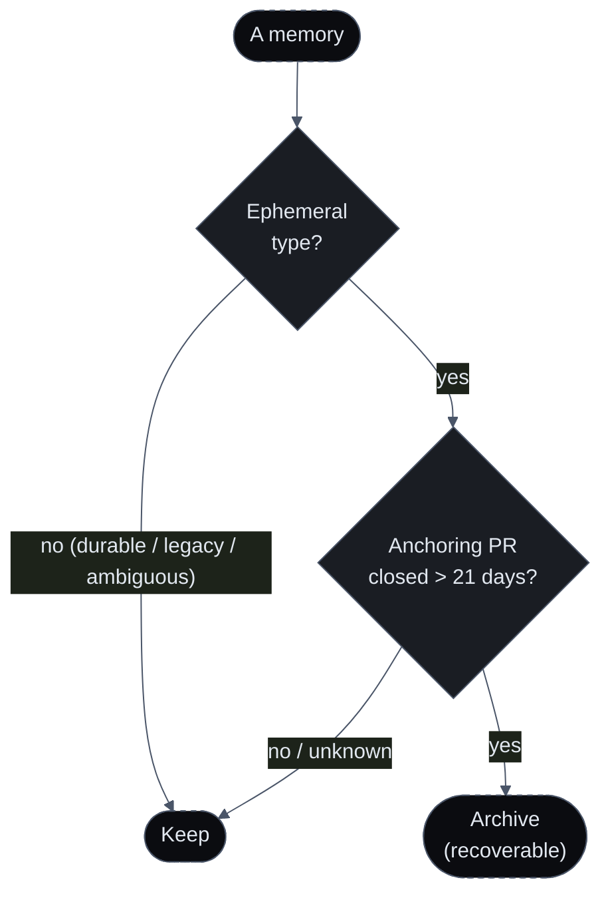

import { Callout, Cards } from 'nextra/components'
import { FeatureCards, FeatureCard } from '@/components/FeatureCards'

# Dynamic Memory & Decay

A memory that only ever grows eventually rots: a rule about a migration that shipped a year ago should not still be shaping today's reviews. But a reviewer that forgets your conventions is useless. Sigilix resolves that tension by classifying every memory by **how long it should live**, then aging out only the throwaway kind — and even then, archiving rather than deleting.

## The four-tier taxonomy

Every learning is classified into exactly one type **at write time**, and the type decides whether it can ever expire:

| Type | What it is | Lifetime |
|---|---|---|
| **Durable preference** | A lasting convention or preference — anything you teach with `@sigilix remember`, or a preference-style rule | Never expires |
| **Architectural fact** | A factual statement about the codebase structure ("payment retries live in `billing/retry`", "we use integer cents") | Never expires |
| **Ephemeral project state** | Task or project state tied to an open PR or branch ("the v2 migration is mid-flight") | Decays after its PR closes |
| **Transient feedback** | A one-off review dismissal or correction tied to a specific PR | Decays after its PR closes |

Each memory also records a **lifespan anchor** — `durable`, or a specific PR / branch — that ties an ephemeral memory to the thing whose closure makes it stale.

### How the type is chosen

Classification is deterministic where it can be, and defers to the model where it can't:

- An explicit **`@sigilix remember`** command is a human asking to remember a convention — a hard override to **durable preference**, never downgraded.
- Otherwise, if the extractor suggested a type, that is honored (only the model can tell an *architectural fact* from a *preference*), with its lifespan anchor reconciled to the actual PR/branch signals.
- If the model was vague, a deterministic fallback decides: a dismissal tied to an open PR is **transient feedback**; anything else tied to an open PR is **ephemeral project state**; everything else is a **durable preference**.

<Callout type="info">
The bias is always toward *keeping*. When the signals are ambiguous, classification lands on a durable type — because forgetting a real convention is a recall regression, while keeping a stale note is a harmless tidy-up deferred.
</Callout>

## The gardener

A background **memory gardener** runs on a schedule (every few hours) and is the only thing that ever reaps a memory. Its eligibility gate is deliberately narrow — a memory is reap-eligible **only when every one of these holds**:

1. it carries the taxonomy fields (legacy records written before the taxonomy are always kept),
2. its type is one of the two **ephemeral** tiers (durable preference and architectural fact are never eligible),
3. its anchor is a specific PR,
4. that PR has a **known closure time**, and
5. the PR has been closed for **more than 21 days**.

Every ambiguous or missing signal — an open or unknown PR, a lookup failure, a non-PR anchor, a durable type — resolves to **keep**. The gardener works in bounded batches per run and fails soft per entry, so a single bad lookup never stalls the pass.

## Archive, not delete

A reaped memory is **moved to a parallel archive keyspace, never hard-deleted**, and stays recoverable. The move is crash-safe by ordering: the archive record is written **first**, and the memory is removed from the active store only after that write succeeds — so a failure mid-way leaves the entry in *both* places (safe and recoverable) rather than *neither* (data loss). Re-archiving the same memory is idempotent, so a retry never duplicates a tombstone.

The result: your conventions persist indefinitely, stale project chatter ages out on its own, and a decay you disagree with can be recovered rather than mourned.

## The statistical layer ages too

The other half of memory — the [statistical accept/dismiss corpus](/memory/review-memory#statistical-acceptdismiss-corpus-secondary) — has its own aging built in. Dismissal signals are kept in a rolling window (on the order of 90 days) with a hard retention ceiling and a per-scope cap, so a category your team stopped dismissing months ago stops shaping reviews. That corpus stores only aggregate signals — never the code, the finding text, or who dismissed it — and paths are keyed by a **one-way hash**, so nothing raw is retained. See [Review Memory](/memory/review-memory) for how those signals shape a review, and [privacy](#privacy) below.

## Measured, not assumed

Because dismissals are recorded with a bounded reason, Sigilix can compute an internal **false-positive-rate ruler** per specialist — treated explicitly as a *lower bound* on the true rate, with statistical confidence intervals and a minimum sample size before a number is trusted. The pipeline is tuned against this ruler, so precision regressions show up as a moving metric rather than as anecdotes. See [Confidence & Proof Tiers](/how-it-works/confidence-scoring#dismissals-feed-a-false-positive-ruler).

## Privacy

<FeatureCards>
<FeatureCard title="Aggregate signals only">
    The accept/dismiss corpus stores counts and bounded reasons — never the finding body, the code it referenced, the PR title, or the reviewer's identity.
</FeatureCard>
<FeatureCard title="Hashed paths">
    File paths in the corpus are keyed by a one-way hash. The corpus can tell that a category is noisy under a path pattern without ever storing the raw path.
</FeatureCard>
<FeatureCard title="Recoverable, not permanent-loss">
    Aged-out memories are archived, not destroyed — so decay is reversible and never silently costs you a real convention.
</FeatureCard>
<FeatureCard title="Scoped to you">
    Every memory keyspace is scoped to your repo or installation. Nothing is shared across customers.
</FeatureCard>
</FeatureCards>

## Read next

<Cards>
<Cards.Card title="Review Memory" href="/memory/review-memory">
    The accept/dismiss corpus and how memory shapes a review end-to-end.
  </Cards.Card>
<Cards.Card title="Org & Seat Layering" href="/memory/org-and-seat-layering">
    How memory is scoped by organization and by developer seat.
  </Cards.Card>
<Cards.Card title="Conversational Learnings" href="/memory/conversational-learnings">
    Where the taxonomy's inputs come from — the rules you teach.
  </Cards.Card>
</Cards>
