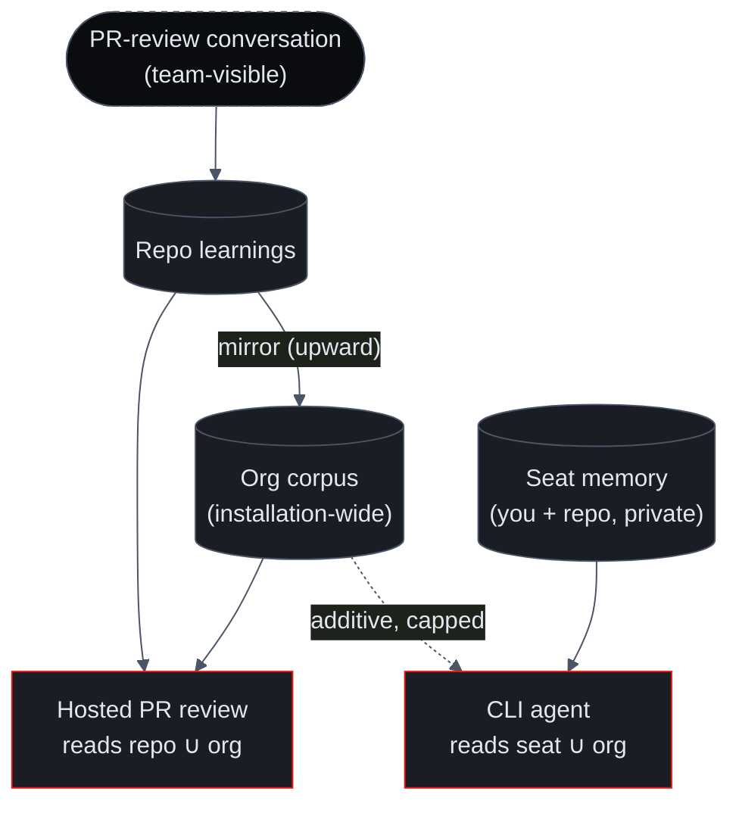

import { Callout } from 'nextra/components'
import { Cards } from '@/components/Cards'
import { FeatureCards, FeatureCard } from '@/components/FeatureCards'

# Org & Seat Layering

Memory lives at two scopes, and the relationship between them is the part that makes it both powerful and safe. **Org memory** is the shared, team-level knowledge that shapes every hosted review. **Seat memory** is what the CLI agent learns while working with one developer. They compose — but only in one direction, and never in a way that leaks one developer's private session into the team's reviews.

## Org memory — the team's shared knowledge

Rules are always captured at **repo scope** first: when you teach a rule on a pull request, it is stored against that repository. A mirror then publishes repo learnings into an **installation-wide org corpus**, so guidance can carry across the repos in your organization rather than being stranded on the one repo where it was taught.

Every hosted PR review reads the **union of the repo's learnings and the org corpus** (the repo's own rules win any collision). This is the single seam through which memory reaches all three read sites of a review — the specialist prompts, the synthesizer, and the post-synthesis suppress gate. Org memory is populated *only* from PR-review conversations — the surfaces your whole team can see.

<Callout type="info">
Org capture and org apply roll out on a staged **off → shadow → on** ladder (the same rollout discipline Sigilix uses for Learnings and SDK guidance), so the behavior can be measured on real traffic before it changes a single review.
</Callout>

## Seat memory — what the CLI agent learns with you

When you work with the [Sigilix CLI](/cli-and-chat/cli) agent, it accumulates a private, per-developer memory scoped to **(you, this repo)** — decisions you made, preferences you expressed, dead ends you hit, corrections you gave, and task state. Unlike learnings, seat memory is recalled **semantically**: each memory is embedded and stored in a vector index namespaced to your seat, so the agent surfaces what's *relevant* to the current work by meaning, not just by path.

Seat memory is additionally scoped by installation, so a seat key can neither read nor write outside its own installation. One developer's seat is structurally isolated from another's — the isolation comes from disjoint keyspaces and vector namespaces, not from a filter that could be misconfigured.

## The union: seat ∪ org

When the CLI agent runs, it reads its own seat memory and **unions in the org's rules** — so the terminal agent knows what the team's PR reviews have taught, not just what you personally have taught it. The mechanics are deliberately conservative:

<FeatureCards>
<FeatureCard title="Additive only">
    The union only ever <em>adds</em> org context to a seat response. It never removes, reorders, or suppresses one of your seat memories.
</FeatureCard>
<FeatureCard title="Seat wins collisions">
    Seat entries come first and win any id collision; org rules are appended after. Your own memory is authoritative over an org-wide rule.
</FeatureCard>
<FeatureCard title="Capped and newest-first">
    Org additions are capped (about 20 rules, newest-first) as a bounded budget, independent of the seat query — so the union stays a sharp nudge, not a flood.
</FeatureCard>
<FeatureCard title="Fail-soft">
    If the org corpus can't be resolved or is empty, the union degrades to seat-only — it is logged, never thrown, and never blocks the seat-memory response.
</FeatureCard>
</FeatureCards>

## One-directional by design

This is the load-bearing safety property of the whole memory system:

- **Hosted PR reviews read org memory only.** The PR-review path never reads any individual's seat memory — the two subsystems share no reader on that path.
- **Teaching flows upward, from public conversations.** The org corpus is written only by mirroring PR-review learnings, and every mirrored rule must originate from a PR-review surface (an inline reply, a top-level comment, or an `@sigilix` Q&A). A developer's private terminal session has no path into org memory.
- **Seat and org never share a writer.** Seat memory and org memory live in separate keyspaces with no shared write path, which is what makes a seat → org leak structurally impossible rather than merely discouraged. It is covered by a dedicated isolation regression test.

Notice what the diagram does **not** contain: there is no arrow from **seat memory** into the **org corpus** or into a **hosted review**. That absence is the guarantee — your private CLI work can draw on the team's shared knowledge, but it can never silently become the team's shared knowledge.

## Why this shape

The one-directional flow gives you the best of both without the risk of either:

- The CLI agent is immediately useful on a new repo because it inherits everything the team's reviews have taught — you don't start from zero.
- The team's review standards are only ever shaped by things said in the open, on PRs, where anyone can see and correct them — never by one person's private terminal session.

## Read next

<Cards>
<Cards.Card title="Conversational Learnings" href="/memory/conversational-learnings">
    How org rules get taught in the first place — and their polarity and scope.
  </Cards.Card>
<Cards.Card title="The Compounding Advantage" href="/memory/compounding-advantage">
    Why an org's accumulated memory makes every subsequent review better.
  </Cards.Card>
<Cards.Card title="Sigilix CLI" href="/cli-and-chat/cli">
    The terminal agent that reads seat ∪ org memory.
  </Cards.Card>
<Cards.Card title="Bring Your Own Key" href="/cli-and-chat/bring-your-own-models">
    The grounding trade-off when the CLI runs on a model you bring.
  </Cards.Card>
</Cards>
