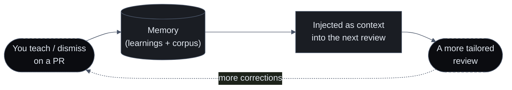

import { Callout } from 'nextra/components'
import { Cards } from '@/components/Cards'
import { FeatureCards, FeatureCard } from '@/components/FeatureCards'

# Memory

A reviewer with no memory is amnesiac by default — tell it once that your codebase uses integer cents and it forgets by the next PR. Sigilix is built the opposite way: guidance you give **once** shapes every review afterward, and it keeps getting more tailored to your team the longer it works on your code.

Memory is the piece competitors can't copy. A model is a commodity — anyone can call the same frontier API. What they cannot clone is **your organization's accumulated context**: the rules your team taught, the patterns it consistently accepts or dismisses, and the verified understanding of your repositories that every review deposits. That corpus is yours, it grows with use, and it makes each subsequent review better-informed than the last.

<Callout type="info">
Memory shapes reviews by **injecting your org's accumulated context** into the same hosted models — it is context and retrieval, not a changed model. Nothing here trains or personalizes a model on your code.
</Callout>

## The layers of memory

Sigilix's memory is not one thing; it is a set of layers that each answer a different question about your repo.

<FeatureCards>
<FeatureCard title="Conversational Learnings">
    The explicit layer. Rules you teach in plain language — <em>"we use integer cents here"</em> — captured, applied judiciously, and attributed inline. See <a href="/memory/conversational-learnings">Conversational Learnings</a>.
</FeatureCard>
<FeatureCard title="Accept / dismiss corpus">
    The implicit layer. Sigilix watches which categories your team consistently acts on or dismisses and calibrates flag-worthiness per repo — never silencing safety findings. See <a href="/memory/review-memory">Review Memory</a>.
</FeatureCard>
<FeatureCard title="Dynamic memory & decay">
    A taxonomy that separates lasting conventions from throwaway project state, so durable rules persist while stale chatter ages out on its own. See <a href="/memory/dynamic-memory">Dynamic Memory &amp; Decay</a>.
</FeatureCard>
<FeatureCard title="Org & seat layering">
    Memory scoped by organization and by individual developer seat, flowing in one deliberate, privacy-preserving direction. See <a href="/memory/org-and-seat-layering">Org &amp; Seat Layering</a>.
</FeatureCard>
</FeatureCards>

Memory is also one facet of the broader [earned-context layer](/how-it-works/earned-context) — the index, code graph, trust ledger, and evidence manifests every review builds. Memory is the part that captures your team's *judgment*; earned context captures your repo's *structure*. Together they are what makes a Sigilix review grounded rather than generic.

## How memory reaches a review

Before the specialists judge a diff, Sigilix loads the relevant learnings for the repo (and, for the CLI agent, unions in the org's rules) and renders them into the review prompt as a clearly-labeled **"Repository-specific guidance (learned from past reviews)"** section — one line per rule, tagged by its polarity (`require` / `context` / `suppress-as-context`). After synthesis, a separate deterministic gate lets a narrowly-scoped `suppress` rule down-weight a noise finding — behind hard safety carve-outs — and attributes the change inline. When a review was shaped by memory, it says so: a **"Memory · N rules applied"** disclosure lists exactly which rules were in play.

## Recall-safety is non-negotiable

Memory makes reviews *quieter*, never *blind*. Every layer that could suppress a finding is wrapped in hard carve-outs: a learning can never drop a P0/P1, a security or logic finding, or anything backed by deterministic evidence, and the suppress gate fails closed when a finding's provenance is unknown. Memory adjusts model judgment calls — it never touches deterministic findings or the safety floor. See [Review Memory](/memory/review-memory#carve-outs-same-as-learnings) for the exact carve-outs.

## Read next

<Cards>
<Cards.Card title="Conversational Learnings" href="/memory/conversational-learnings">
    Teach a rule in plain language; see it applied and attributed inline.
  </Cards.Card>
<Cards.Card title="Review Memory" href="/memory/review-memory">
    How a learning shapes a review, plus the statistical accept/dismiss layer.
  </Cards.Card>
<Cards.Card title="Dynamic Memory & Decay" href="/memory/dynamic-memory">
    The taxonomy, the gardener, and how stale habits age out.
  </Cards.Card>
<Cards.Card title="Org & Seat Layering" href="/memory/org-and-seat-layering">
    Org memory, per-developer seat memory, and the one-directional flow between them.
  </Cards.Card>
<Cards.Card title="The Compounding Advantage" href="/memory/compounding-advantage">
    Why every review gets better-informed per org over time — the moat.
  </Cards.Card>
<Cards.Card title="Earned Context" href="/how-it-works/earned-context">
    The broader verified layer memory is part of — index, graph, trust ledger.
  </Cards.Card>
</Cards>
