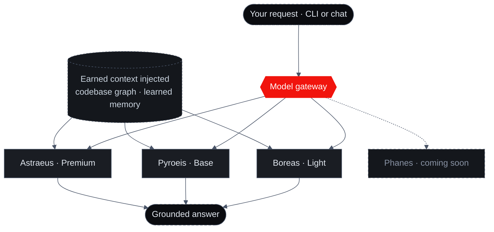

import { Callout, Cards, Steps } from 'nextra/components'
import { FeatureCards, FeatureCard } from '@/components/FeatureCards'

# Models

Sigilix runs its own model line — **Boreas, Pyroeis, Astraeus,** and **Phanes**. They're built in-house and grounded in your repository's code graph and your team's learned memory, not raw scale. The line runs from Light to Premium: you pick the tier of reasoning a task needs, and the context stays constant.

<Callout type="info">
One moat, four models. A smaller model grounded in your codebase beats a bigger, blind one on your code — every time. See [the grounding thesis](#why-grounded-models-win) below.
</Callout>

## The model line

<FeatureCards>
<FeatureCard title="Boreas · Light · 3.1">
    The everyday model. Fast enough to sit behind every keystroke in the CLI and every pull-request review without making you wait — kept sharp by your codebase, not raw scale. "Light" means low-latency, never less capable.
</FeatureCard>
<FeatureCard title="Pyroeis · Base · 3.0">
    The balanced model. When a task needs more than a fast pass — multi-file changes, agentic steps, deeper refactors — Pyroeis brings heavier reasoning while staying fully grounded in your architecture and your team's accumulated memory.
</FeatureCard>
<FeatureCard title="Astraeus · Premium · 3.0">
    The deepest-reasoning model. The tier for the changes that carry the most risk — subtle logic, security, cross-file blast-radius — spending maximum reasoning with total codebase grounding and your org's memory behind it.
</FeatureCard>
<FeatureCard title="Phanes · Coming soon">
    The next model in the line. Built on the same foundation — codebase grounding and learned memory — to push further into autonomous engineering. Arriving soon.
</FeatureCard>
</FeatureCards>

<Callout type="info">
**Boreas, Pyroeis,** and **Astraeus** are available today. **Phanes** is coming soon.
</Callout>

## Pick the tier of reasoning you need

The context is constant across the line — every model reasons over the same verified [earned-context layer](/how-it-works/earned-context). What changes between tiers is how much reasoning is spent, and how quickly:

<Steps>

### Boreas for the routine

Run the fast, grounded pass behind the CLI and standard PR reviews — the loop you want instant.

### Pyroeis for the substantial

Reach for the balanced tier on multi-file work, agentic steps, and deeper refactors.

### Astraeus for the high-stakes

Spend the deepest reasoning where a mistake is most expensive — security, subtle logic, wide blast-radius.

</Steps>

Model tiers do **not** map to plan tiers. Every plan can pick Boreas, Pyroeis, or Astraeus — the deeper tiers simply consume more of your [usage](/usage-and-limits), so higher plans have the headroom to run them more. You can change your model as your needs change.

## Routing and grounding

Whichever tier you pick, the request goes through the Sigilix **model gateway**. The gateway routes to the model behind that tier — and, crucially, **injects your earned context before the model ever reasons**. Grounding is not a property of a particular model; it's assembled from your codebase graph and learned memory and handed to whichever tier ran. That's why a lighter tier is still grounded, and why switching tiers changes the depth of reasoning without changing what the model knows about your repo.

## Why grounded models win

Generic models guess. Sigilix models know. The difference isn't parameter count — it's what the model reasons over:

<FeatureCards>
<FeatureCard title="Codebase graph">
    Every answer is grounded in your repository's graph — callers, dependencies, and symbols across the whole repo, not a window of lines.
</FeatureCard>
<FeatureCard title="Learned memory">
    Org memory and per-seat memory — the rules your team has taught and the reviews Sigilix has already run — shape every response.
</FeatureCard>
<FeatureCard title="Grounded output">
    Because the model reasons from verified context, its output is anchored to real code rather than a plausible-sounding guess.
</FeatureCard>
</FeatureCards>

This is the whole bet: a smaller, grounded model beats a bigger, blind one on your code. The value isn't the model in isolation — it's the verified context every model in the line reasons over.

## Bring your own key (CLI only)

The Sigilix models are the default everywhere. On paid tiers, the **CLI** can optionally run on **your own model-provider API key** — OpenAI, Anthropic, or OpenRouter — billed directly to you. Whatever model you connect still fetches Sigilix's verified [earned-context layer](/how-it-works/earned-context), so it inherits the grounding without re-deriving your repo. This is **CLI-only and opt-in**: the [Deep-Research Chat](/cli-and-chat/deep-research) always runs on the Sigilix line. See [Bring Your Own Key](/cli-and-chat/bring-your-own-models).

<Callout type="info">
On the hosted PR ensemble, each specialist — logic, security, performance, and tests, unified by the synthesizer — runs the model tuned to its role, behind cross-provider fallback so one provider's outage can't silence a specialist. See [The Ensemble](/how-it-works/the-ensemble).
</Callout>

## Read next

<Cards>
<Cards.Card title="Usage & Limits" href="/usage-and-limits">
    How usage is metered per model, the two pools, and the windows that reset.
  </Cards.Card>
<Cards.Card title="Bring Your Own Key (CLI)" href="/cli-and-chat/bring-your-own-models">
    Optionally run the CLI agent on your own OpenAI, Anthropic, or OpenRouter key.
  </Cards.Card>
<Cards.Card title="The Ensemble" href="/how-it-works/the-ensemble">
    How per-role tuned models power the hosted PR review.
  </Cards.Card>
</Cards>
