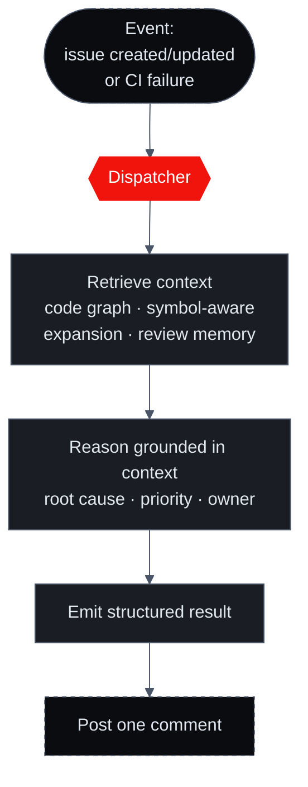

import { Cards, Steps } from 'nextra/components'
import { FeatureCards, FeatureCard } from '@/components/FeatureCards'

# How Triage Works

Both kinds of triage — [issue triage](/triage/issue-triage) and [CI-failure triage](/triage/ci-failure-triage) — run the same shape of pipeline. An event arrives, the dispatcher routes it, Sigilix retrieves the relevant code, reasons about it grounded in that context, emits a structured result, and posts a single comment. The defining principle of the whole pipeline is one line: **it reads the code, not just the words in the ticket.**

## The flow

<Steps>

### Event

A webhook fires from your forge or issue tracker: an issue is created or updated (Linear/Jira), or a CI check fails (GitHub). Triage is event-driven — it reacts to the things that signal triage is needed.

### Dispatcher routes to triage

The [dispatcher](/how-it-works/the-dispatcher) classifies the event and hands it to the triage pipeline rather than the full ensemble. This is the cost-and-latency isolation the dispatcher exists for: triage gets a path sized to its job, not a four-specialist review.

### Retrieve the relevant code

Triage pulls the code the event is about from the [earned-context layer](/how-it-works/earned-context) — using the code graph and symbol-aware expansion to find the functions, callers, and dependencies implicated, and reconciling against review memory. This is the step that makes triage read the code, not just the ticket.

### Reason, grounded in that context

With the real code in hand, Sigilix reasons about root cause, priority, and owner — each conclusion grounded in something concrete it retrieved (a call path, an ownership record, a failing assertion, a log line).

### Emit a structured result

The reasoning is shaped into a structured result — fields for issue triage (title, priority, severity, estimate, owner, root cause, related work, duplicates, missing info), or a root-cause-and-evidence shape for CI triage.

### Post as a single comment

The structured result is rendered into one coherent comment and posted back to the issue or PR thread — reviewable, editable, acceptable.

</Steps>

## Reads the code, not just the words

This is the part that separates Sigilix triage from a model summarizing a ticket. A title that says "checkout is slow" tells you almost nothing; the function it implicates tells you everything. Triage resolves the ticket's symptom onto the actual symbols in your repo, then retrieves and reasons about *those*.

<FeatureCards>
<FeatureCard title="Code graph">
    Resolves the implicated symbol to its callers, dependencies, and blast radius — so priority reflects what the code touches, and root cause accounts for the real call path.
</FeatureCard>
<FeatureCard title="Symbol-aware expansion">
    Pulls the specific functions and definitions the issue or failure references, plus the surrounding code needed to judge them — not a fixed window of lines.
</FeatureCard>
<FeatureCard title="Review memory">
    Reconciles against what Sigilix has already learned about the repo: prior issues on the surface, recurring failure shapes, and accepted/dismissed signal.
</FeatureCard>
</FeatureCards>

## Grounding: cites real code

Triage shares the anti-hallucination discipline of the review path. The conclusions it emits must be anchored to evidence it actually retrieved or read — and a conclusion that cannot be grounded is not posted as if it were certain.

Why grounding matters most in triage

A triage result that *sounds* right but points at the wrong code is worse than no result, because it sends a developer down the wrong path. So triage holds its conclusions to evidence: a root cause cites the line, a priority cites the blast radius it traced, an owner cites ownership and history.

  

CI triage enforces it

The [CI-failure path](/triage/ci-failure-triage) enforces grounding hardest: the root cause must cite the failure evidence — the log line and/or the diff line — or it does not post. This is deliberate, because a confidently-wrong CI root cause is the highest-cost mistake triage can make.

  

Shared with the believability pipeline

The same grounding gate that suppresses unanchored review findings in the [believability pipeline](/how-it-works/believability-pipeline) governs triage. Believability is architectural here too: a claim earns its place by citing the code it stands on.

## Why it reuses earned context

Triage doesn't build its own understanding of your repo from scratch — it reads from the [earned-context layer](/how-it-works/earned-context) that reviews already deposited. That has two consequences:

- **Cheaper and faster.** The index and code graph are already built, so triage retrieves rather than rediscovers — which is exactly the kind of fast, sized-to-the-job path the dispatcher routes triage onto.
- **More grounded over time.** Every review adds to the trust ledger, review memory, and evidence manifests. Triage inherits that accumulating understanding, so it gets sharper on a repo the longer Sigilix has worked on it.

## One event in, one comment out

The whole pipeline collapses to a simple contract: a single event produces a single grounded comment in the place the work already lives. No new dashboards to check, no second tool to open — the triaged result is waiting on the issue or the PR.

## Read next

<Cards>
<Cards.Card title="Issue triage" href="/triage/issue-triage">
    What each issue field is grounded from, with a before/after example.
  </Cards.Card>
<Cards.Card title="CI-failure triage" href="/triage/ci-failure-triage">
    Turning a red build into a grounded, inline root cause.
  </Cards.Card>
<Cards.Card title="Earned Context" href="/how-it-works/earned-context">
    The index, code graph, memory, and manifests triage reads from.
  </Cards.Card>
<Cards.Card title="The Dispatcher" href="/how-it-works/the-dispatcher">
    How events get classified and routed to triage.
  </Cards.Card>
</Cards>
