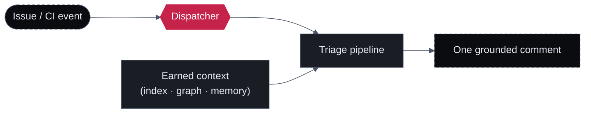

# Triage

Most of what slows a team down between "something is wrong" and "someone is fixing it" is triage: rewriting a vague ticket into something searchable, deciding how badly it matters, guessing who owns it, and reading logs to find the real cause. Sigilix automates that work — not by paraphrasing the words in the ticket, but by **reading the code the ticket is about**.

Triage is one of the pipelines the [dispatcher](/how-it-works/the-dispatcher) routes to, alongside the PR overview, the full ensemble review, describe/improve slash commands, and `@sigilix` Q&A. It reuses the same [earned-context layer](/how-it-works/earned-context) that every review builds — the index, the code graph, the trust ledger, review memory, and evidence manifests — so a triaged result is grounded in a verified understanding of your repository, not a one-off read.

<Note>
Sigilix is in **private beta**. [Join our private beta →](https://app.sigilix.ai)
</Note>

## Two kinds of triage

<CardGroup cols={2}>
  <Card title="Issue triage" icon="list-check" href="/triage/issue-triage">
    Linear and Jira issues, natively. Sigilix reads the issue and the code, then rewrites the title, sets priority and severity by blast radius, estimates effort, suggests an owner, root-causes in file:line terms, links related work, catches duplicates, and flags what's missing — posted as one grounded comment.
  </Card>
  <Card title="CI-failure triage" icon="circle-exclamation" href="/triage/ci-failure-triage">
    When a build goes red, Sigilix reads the job logs against the diff and posts a grounded, inline root-cause comment in file:line terms — instead of leaving you to scroll a raw log dump.
  </Card>
</CardGroup>

## What "grounded" means here

The defining property of triage is that every claim is anchored to evidence Sigilix actually read. A priority isn't asserted because the title sounds scary — it's set by the blast radius Sigilix traced through the code graph. A root cause isn't a confident guess — it cites the failing line, the failing assertion, or the log line that proves it.

This matters most in CI-failure triage, where the temptation to emit a plausible-but-wrong root cause is highest. That path **enforces grounding**: the output must cite the failure evidence. A root cause that can't point at the log line or diff line that justifies it does not post.

<CardGroup cols={3}>
  <Card title="Reads the code" icon="code">
    Triage retrieves the relevant code via the code graph and symbol-aware expansion — it reasons about the function the ticket names, not just the ticket text.
  </Card>
  <Card title="Cites real evidence" icon="file-lines">
    Priority, severity, effort, owner, and root cause each rest on something concrete: a call path, an ownership record, a failing assertion, a log line.
  </Card>
  <Card title="Posts one comment" icon="comment">
    The result lands as a single structured comment on the issue or the PR — reviewable, editable, and acceptable on your terms.
  </Card>
</CardGroup>

## Where triage sits in the system

The dispatcher classifies the incoming event — an issue created or updated, or a CI check that failed — and hands it to the triage pipeline. Triage retrieves the relevant code, reasons about it, and writes back to where the work already lives: the Linear/Jira issue, or the PR thread.

## Read next

<CardGroup cols={2}>
  <Card title="Issue triage" icon="list-check" href="/triage/issue-triage">
    Linear and Jira issue triage in depth — what each field is set from and why.
  </Card>
  <Card title="CI-failure triage" icon="circle-exclamation" href="/triage/ci-failure-triage">
    From a red build to a grounded root cause, with grounding enforced.
  </Card>
  <Card title="How triage works" icon="diagram-project" href="/triage/how-triage-works">
    The architecture: event → dispatcher → retrieve code → reason → emit → post.
  </Card>
  <Card title="The Dispatcher" icon="diagram-project" href="/how-it-works/the-dispatcher">
    How one webhook routes to many pipelines, triage among them.
  </Card>
</CardGroup>
